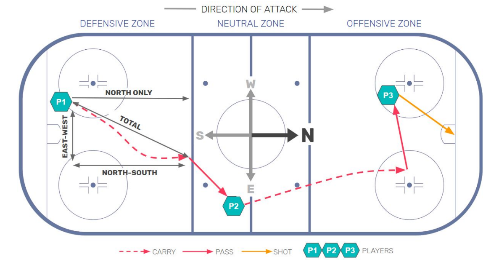

# Hockey Pace Explorer

Presented by Raphael Fontaine  
Hosted app: https://hockey-pace-explorer.xyz

## Table of contents

- [Research overview](#research-overview)
- [Data pipeline](#data-pipeline)
- [Run the project](#run-the-project)

## Research overview

<h3 align="center">“When is faster puck movement associated with more successful plays?”</h3>

Playing faster does not always mean playing more effectively. This project examines how pace relates to passing, zone entries, shots, and puck recovery, then provides a game-review tool to explore the possessions behind those patterns.

### Background

The project adapts the framework introduced by Yu et al. (2019) in [_Playing Fast Not Loose_](https://arxiv.org/abs/1902.02020). Their research examined how puck movement pace varies across the ice and relates to play outcomes. This project adapts their approach to examine the relationship between puck movement pace and success across a broader range of play situations.

### Data and preparation

The project uses Stathletes event data published in the [Big Data Cup repository](https://github.com/bigdatacup/Big-Data-Cup-2021). Game Review covers the six supplied games from the 2022 women's Olympic tournament. Pace & Outcomes combines these games with the extended datasets provided in the repository, covering 34 games across three event datasets. Raw records are standardized into events and grouped into possessions, from which pace and play outcomes are calculated.

### What is pace?

<table>
<tr>
<td width="55%" valign="top">
<p>Pace measures how quickly a team moves the puck during possession, through both carries and passes. It is calculated from the distance and elapsed time between successive puck events.</p>
<p><strong>Pace = reconstructed puck movement distance ÷ elapsed time</strong>
, expressed in feet per second (ft/s).</p>
<table><thead><tr><th>Component</th>
<th>What it measures</th>
</tr>
</thead>
<tbody><tr><td>Total</td>
<td>Movement in any direction.</td>
</tr>
<tr><td>Forward (North-only)</td>
<td>Movement toward the opponent's goal; backward movement contributes zero.</td>
</tr>
<tr><td>Lateral (East-west)</td>
<td>Movement across the width of the rink.</td>
</tr>
<tr><td>Longitudinal (North-south)</td>
<td>Movement along the length of the rink, forward or backward.</td>
</tr>
</tbody>
</table>
<p>Event locations and timing describe the puck's progression through a possession. The resulting pace combines movement across events, rather than measuring a player's skating speed or the flight speed of a single pass.</p>
<p>The figure on the right follows a puck recovery through carries and passes to a shot; the backward pass to P3 contributes to total pace but not forward pace.</p>
</td>
<td width="45%" valign="middle">
<figure>
<p>Image: Figure 1 from <a href="https://arxiv.org/abs/1902.02020" target="_blank" rel="noopener noreferrer"><em>Playing Fast, Not Loose</em>
</a>
 by David Yu, Christopher Boucher, Luke Bornn, and Mehrsan Javan (2019).</p>
</figure>
</td>
</tr>
</table>

### Analytical approach

5v5 observations are divided into four roughly equal-sized pace groups (quartiles), from slowest (Q1) to fastest (Q4). The analyses compare:

- Shot generation after controlled entries.
- Carried, played, and dumped entry choices.
- Pass completion and shots reaching the net.
- Puck recovery after dump-ins.
- Shot generation following offensive-zone recoveries.

Most analyses measure pace before an event. The offensive-zone recovery analysis instead measures pace after recovery, through the first shot or possession end. Each analysis’s measurement window and outcome definition accompany its results on the [Pace & Outcomes](https://hockey-pace-explorer.xyz/pace-outcomes) page.

The [Game Review](https://hockey-pace-explorer.xyz/game-review) tool connects these measures to individual games. The spatial polygrid shows where puck movement is faster or slower; the team-and-period chart compares pace across teams and periods; the possession table lets users select a possession; and the rink plot shows its events and puck movement.

### Interpretation and limitations

The results do not establish that faster puck movement leads to more successful plays, but they provide insight into how pace and outcomes vary across different play situations. These associations require careful interpretation: faster movement may help create an opportunity, but it may also arise because an opportunity already exists, for example, when open space allows a team to advance quickly. Player ability, defensive pressure, and game state can influence both pace and execution, so differences between pace groups cannot be attributed to pace alone. The following limitations should therefore be considered when interpreting the results.

- **Event-based measurement:** Movement is reconstructed between recorded locations rather than measured through continuous puck tracking.
- **Timing resolution:** Timestamps have one-second resolution. Events sharing a timestamp are ordered using modeled timing, but their precise spacing within that second is unknown, which can affect pace over short intervals.
- **Play context:** Comparisons do not adjust for factors such as defensive pressure, player ability, or game state. Restricting outcomes to 5v5 controls manpower, but does not make the play situations otherwise equivalent.

### Future work

- _How does pace relate to momentum throughout a game?_ Examine whether changes in puck movement pace precede or follow shifts in territorial control and scoring opportunities.
- _How do defenses respond to faster puck movement?_ Investigate changes in defensive positioning, pressure, and the ability to regain control.
- _Which player combinations generate and sustain pace?_ Extend the player-level pace framework proposed by [Yu et al. (2019)](https://arxiv.org/abs/1902.02020) to lines and combinations, exploring how players together influence attacking and defending pace.

### References

- Yu, D., Boucher, C., Bornn, L., & Javan, M. (2019). _Playing Fast Not Loose: Evaluating team-level pace of play in ice hockey using spatio-temporal possession data_. [arXiv:1902.02020](https://arxiv.org/abs/1902.02020).
- Silva, R. M., Davis, J., & Swartz, T. B. (2018). _The evaluation of pace of play in hockey_. Journal of Sports Analytics, 4(2), 145–151. [doi:10.3233/JSA-170192](https://doi.org/10.3233/JSA-170192).
- Shen, E., Santo, S., & Akande, O. (2022). _Analyzing pace-of-play in soccer using spatio-temporal event data_. Journal of Sports Analytics, 8(2), 127–139. [doi:10.3233/JSA-200581](https://doi.org/10.3233/JSA-200581).
- Stathletes. _Big Data Cup: Event data and documentation_. [GitHub repository](https://github.com/bigdatacup/Big-Data-Cup-2021).

## Data pipeline

**Raw CSV → standardized events → possessions and movement transitions → analytical Parquet tables → SQLite → Python API → web app**

### Ingestion and standardization

The NWHL, Womens, and Olympics 2022 datasets describe similar plays using different schemas and event conventions. [Notebook 01](notebooks/01_event_processing.ipynb) brings them into a common event model so the same possession and outcome rules can be applied across sources. It harmonizes field names, event and outcome labels, clock formats, and team references. Pass records are expanded into separate release and reception events, preserving their order.

### Cleaning and validation

Checks cover required values, identifiers and relationships, coordinate bounds, countdown clocks, and event ordering. These checks matter because an incorrect team attribution or reversed interval can change both possession ownership and calculated pace. [Notebook 02](notebooks/02_data_augmentation.ipynb) retains recorded clocks alongside modeled within-second timing to distinguish successive positions sharing a timestamp.

### Derived data

[Notebook 02](notebooks/02_data_augmentation.ipynb) reconstructs possessions and their movement transitions. [Notebook 03](notebooks/03_pace_components.ipynb) derives possession pace, pooled team-and-period summaries, and game spatial maps. Notebooks [04](notebooks/04_entries_outcomes.ipynb), [05](notebooks/05_pass_outcomes.ipynb), [06](notebooks/06_shot_outcomes.ipynb), [07](notebooks/07_oz_recovery_outcomes.ipynb), [08](notebooks/08_entry_type_outcomes.ipynb), and [09](notebooks/09_dump_in_outcomes.ipynb) produce the six outcome summaries. Calculations are completed in the notebooks and exported as Parquet tables matching the database schema. This keeps analytical definitions in one place and lets the API serve results without recalculating them for each request.

Current data volumes across the three sources:

| Measure                       |  Count |
| ----------------------------- | -----: |
| Raw CSV records               | 61,493 |
| Standardized events           | 86,670 |
| Events movement transitions   | 63,298 |
| Reconstructed possessions     | 16,046 |

The event count increases through pass release/reception expansion and one documented missing penalty shot event.

### Database loading and reproducibility

Parquet files provide an inspectable handoff between research and the application. [The importer](backend/app/ingest.py) loads their existing values into SQLite, checking column types, primary keys, foreign keys, and cross-table consistency. SQLite suits this fixed dataset and keeps the demo easy to run without a separate database service.

To regenerate the analytical artifacts, run notebooks 01–09 in order. To rebuild SQLite from the supplied Parquet files, stop the backend and run this command from the repository root:

```sh
uv run python -m backend.app.ingest
```

## Run the project

Requirements: Python 3.12+, Node.js 24, and uv.

From the repository root, install the Python dependencies and start the backend:

```sh
uv sync
uv run uvicorn backend.app.main:app --reload
```

In a second terminal, install the frontend dependencies and start the frontend:

```sh
cd frontend
npm ci
npm run dev
```

Open [http://localhost:5173](http://localhost:5173). Keep both terminals running.

The database is included, so no notebook execution or data import is needed.
